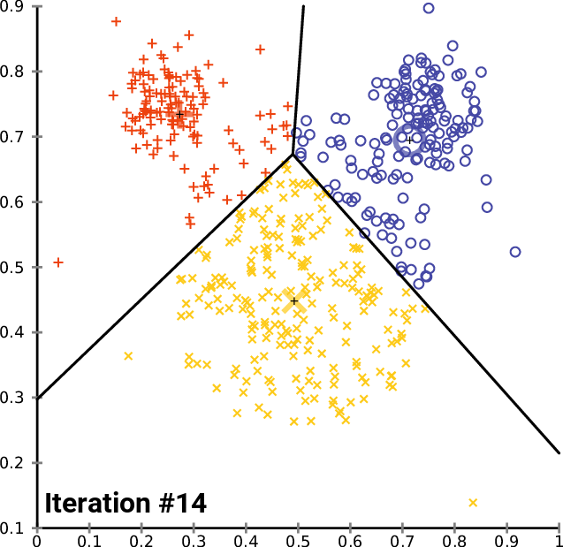

## K-Means Algorithm in MQL5 
    This brach of the Data mining repository in MQL5 consist of the widely used clustering algorithm,
    The K-Means clustering algorithm to understand how it works Read this [Article](https://www.mql5.com/en/articles/11615)
    
    

    Any contribution to the library will be appreciated

    [BuyMeACoffee] (https://www.buymeacoffee.com/omegajoctan)